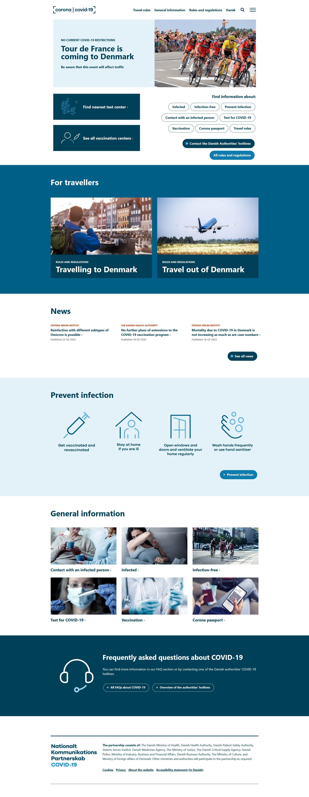

# Corona | Covid-19 landing page

This is a copy of a main page of a website about Covid-19 that I've made. Original website: https://en.coronasmitte.dk/

The task was to code the main page myself and get it as close to the original as possible. The main objective however was to use Tailwind CSS which I did not know at that point. I liked the challenge, I've watched one YouTube tutorial on Tailwind CSS and began coding the project myself, looking up official documentation from time to time. I think it came out pretty nicely.

I've installed Tailwind CSS via NPM and I've also used Tailwind Elements libray via CDN for the carousel. The page is fully responsive, has a little bit of custom CSS beside Tailwind CSS and a bit of JS for the navigation menu.

## Overview

### The challenge

### Screenshot

### Links

- Live Site URL: [HERE](https://radoslawlagan.github.io/Corona-covid-19-landing-page/)

## My process

### Built with

- HTML
- CSS
- Flexbox
- Grid
- JS
- RWD
- Mobile First
- Tailwind CSS
- Tailwind Elements (https://tailwind-elements.com/)
